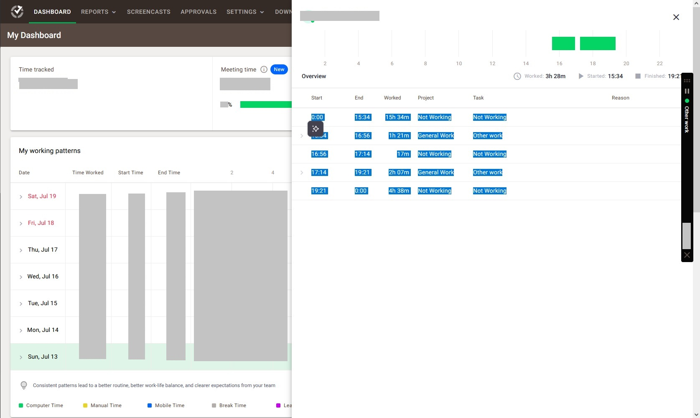

## Usage

1. Open Time Doctor 2 Dashboard in browser
1. Use Date Range to see specific days (up to 7)
1. Click on a day entry
1. Select time entries as in the example image 
1. Ctrl+C the selection then Ctrl+V it in a file `<month>-<day>.txt` inside the `data/` folder
    - Example: for August 5th, name the file `08-05.txt`
1. Do this for all days worked (don't create files for empty days)
1. Run `uiua main.ua --month M --day D` to get the entries for the week that starts on day D
    - Optionally, add `--stop-at-day S` if the week has less than 7 days (applies to first week of the month unless the month starts at a Sunday)
        - `--stop-at-day` is unnecessary for the last week since the script will look for days 32, 33, 34 etc. and just ignore them since they don't have a file
1. The script throws its output in the clipboard automatically, just Ctrl+V in the spreadsheet

**IMPORTANT**: The script considers intervals of less than 2 minutes between time entries to be irrelevant and just merges the entries. Because of that, the output might have a few more minutes than the Time Doctor report.

---

## Requirements

- uiua (tested on version 0.16.2)